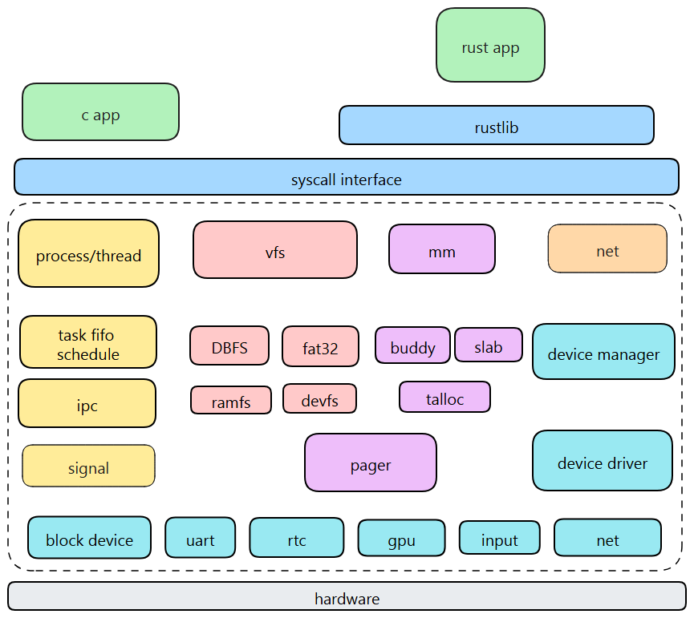

## AlienOS 学习笔记

这个图好像挺清楚的： 从说明网页上找到的

主要分为了5个部分：任务管理、内存管理、文件系统、设备管理和网络管理。对用户层暴露各种系统调用。

架构上，感觉各模块之间用的 Rust 的 `mod` 进行模块化：只有`kernel`是一个`crate`，其他的子系统都是用`mod`引入。

此外，用`Cargo Features`进行选择，可以选择性的启用一些子系统。